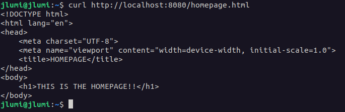
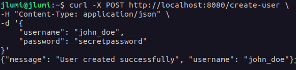

# HTTP-server

This is a HTTP server implemented in C that handles both GET and POST requests.

## Running the Server

To run the server, execute the following commands in your terminal after cloning the repository:

```
make
./server
```

## Features
### Handling GET Requests

While the server is active, it can process GET requests and send appropriate responses. For example, to request a file named "homepage.html":

```
curl http://localhost:8080/homepage.html
```

Any files you want to serve should be placed in the "server_resources" directory.



### Handling POST Requests

The server also supports POST requests. For instance, to create a new user, send a POST request like this:

```
curl -X POST http://localhost:8080/create-user \
-H "Content-Type: application/json" \
-d '{
    "username": "john_doe",
    "password": "secretpassword"
}'
```

The server processes the POST request and adds the user to the "users.txt" file within the "server_resources" directory.



## Creating Custom API Enpoints

You can also add your own API endpoints by following these steps:

1. Define the prototype of your endpoint in the "message_handle_tools.h" file.
2. Inside the "endpoints.c" file, create the functionality for your custom API endpoint.
3. Add a case for it in the api_call function inside the "message_handle_tools.c" file to handle your custom endpoint requests.
